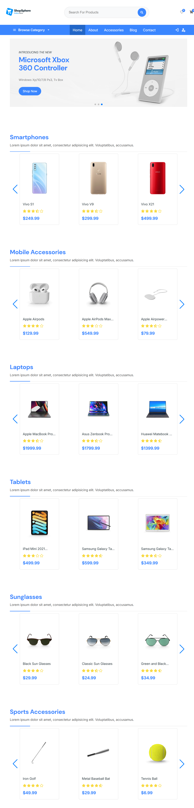
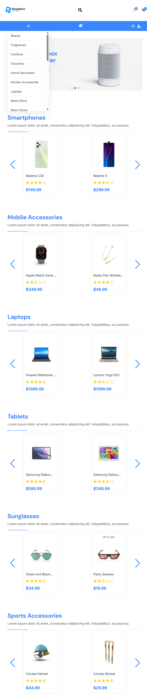
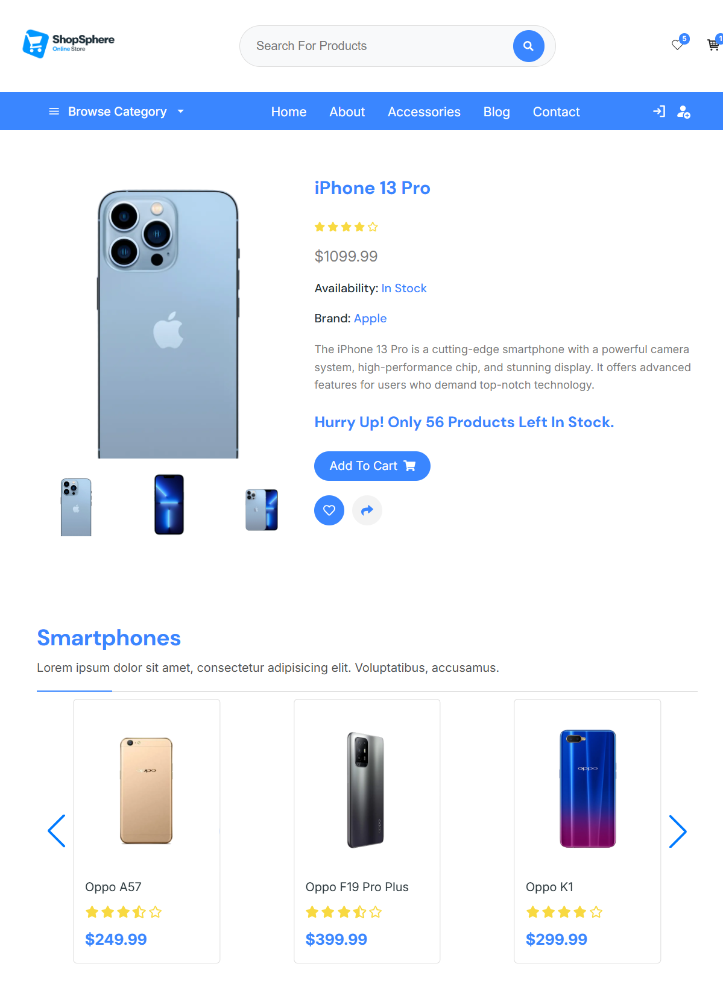
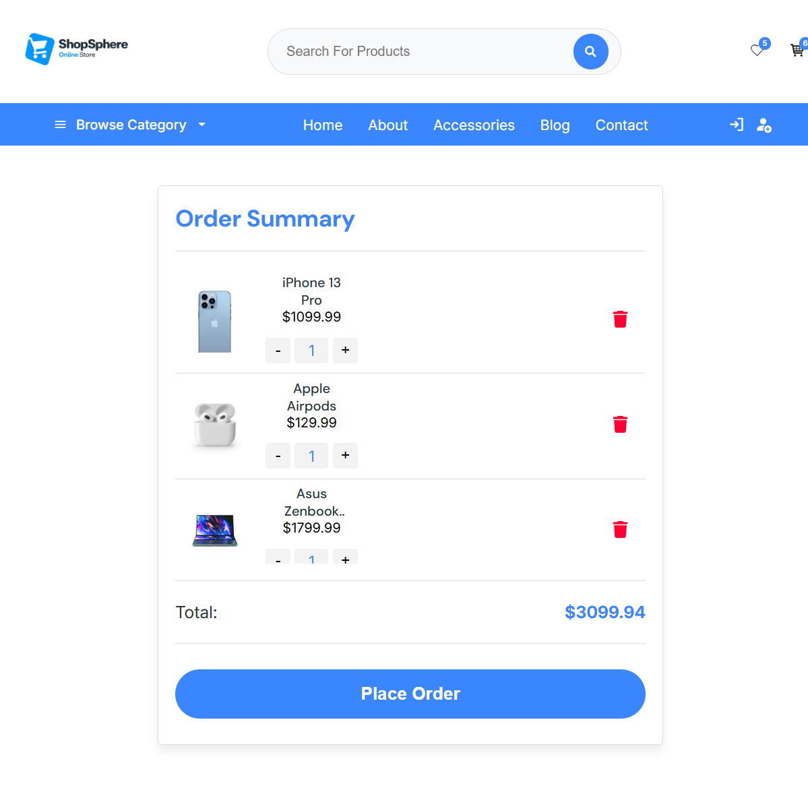
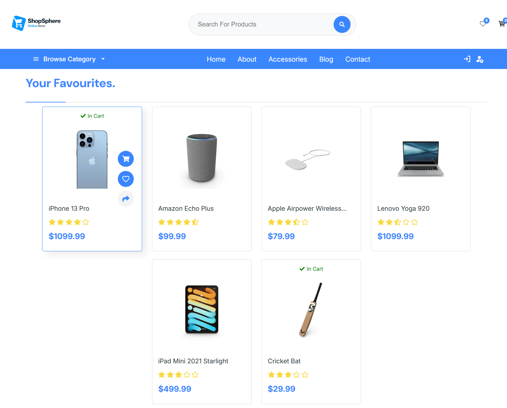
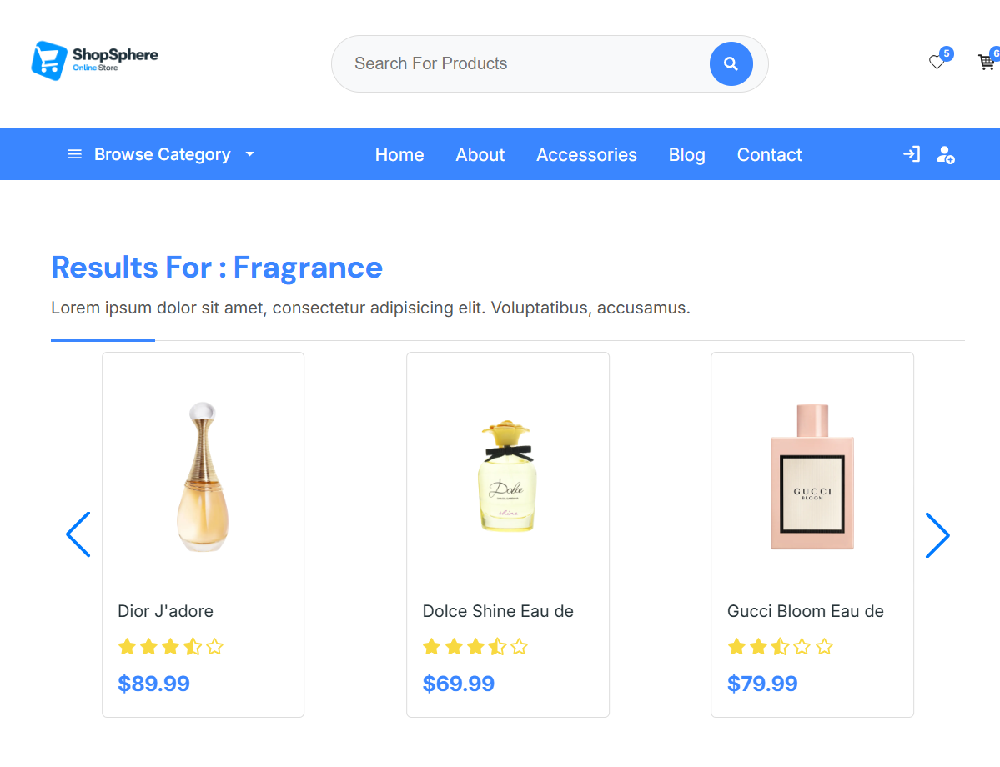

# 🛒 Shop-Sphere (Practice Project)

> A responsive frontend E-Commerce web application built with React and Vite. 

**Shop-Sphere** is a personal practice project developed to apply and demonstrate fundamental React concepts in a real-world scenario. While it simulates an e-commerce platform with product browsing, categorized views, and a shopping cart, it relies on mock data and serves as a portfolio project focused on frontend architecture, performance, and user experience.

## 🚀 Features

- **Product Catalog**: Browse products across predefined categories (Smartphones, Laptops, Accessories, etc.) fetched from a mock API.
- **Search Functionality**: A basic search bar to find specific items by name.
- **Product Details Page**: View details, images, and pricing for individual mock products.
- **Shopping Cart**: Add items to the cart, adjust quantities, and view the total price. 
- **Favorites List**: A basic wishlist feature to save items for quick access.
- **Page Transitions**: Simple animations using Framer Motion when navigating between different views.
- **Basic Error Handling**: Handles loading states and basic data fetching errors.
- **Responsive Design**: Optimized for mobile, tablet, and desktop screens.

## 📸 Screenshots & Demo

> 🔗 **Live Demo:** https://shop-spheree1.netlify.app/ 

| Home | Mobile | Product | Cart |
|------|--------|--------|------|
|  |  |  |  |

| Favorites | Search |
|----------|--------|
|  |  |

## 🛠️ Tech Stack & Tools

- **Frontend:** [React 19](https://react.dev/), [Vite](https://vitejs.dev/)
- **Routing:** [React Router (v7)](https://reactrouter.com/) for client-side navigation
- **State Management:** React Context API (Cart and Favorites states)
- **Styling:** Vanilla CSS
- **Animations:** [Motion](https://www.framer.com/motion/)
- **UI Libraries:** [Swiper](https://swiperjs.com/) (image carousels), [React Hot Toast](https://react-hot-toast.com/) (notifications), [React Icons](https://react-icons.github.io/react-icons/)
- **Backend/Data:** [DummyJSON API](https://dummyjson.com/) (mock REST API)

## ⚙️ Installation & Setup

To run this practice project locally:

### 1. Clone the Repository
```bash
git clone https://github.com/yassenahmed77/Shop-Sphere.git
cd Shop-Sphere
```

### 2. Install Dependencies
Make sure you have [Node.js](https://nodejs.org/) installed, then run:
```bash
npm install
```

### 3. Start the Development Server
```bash
npm run dev
```
The app will be available at `http://localhost:5173`.

## 📖 Usage Guide

- **Home Page**: Scroll through category sliders or select a category from the header.
- **Search**: Type in the top search bar to filter products by their name.
- **Cart**: Click a product card to open its details, pick a quantity, and click 'Add to Cart'. You can interact with your selections in the cart view.
- **Favorites**: Click the heart icon on any product to add it to your saved Favourites list.

## 🏗️ Folder Structure

```Projects
Shop-Sphere/
├── public/                 
└── src/
    ├── Components/         # React components (Cart, Header, Contexts, Products, Sliders)
    ├── Favourites/         # Favourites-related view logic
    ├── Images/             # Local image assets
    ├── Pages/              # Route views (Home, Category, Product-Details, Searched-Products)
    ├── App.jsx             # Main Router configuration
    ├── index.css           # Global CSS styling
    └── main.jsx            # React root component
```

## 🔌 API Reference

This application uses the free **[DummyJSON API](https://dummyjson.com/)** to fetch all mock data:
- `GET /products/category/{category_name}` 
- `GET /products/{id}` 
- `GET /products/search?q={search_query}` 

## 📞 Contact

**Yassen Ahmed**
- GitHub: [@yassenahmed77](https://github.com/yassenahmed77)
- Repository: [Shop-Sphere](https://github.com/yassenahmed77/Shop-Sphere)
